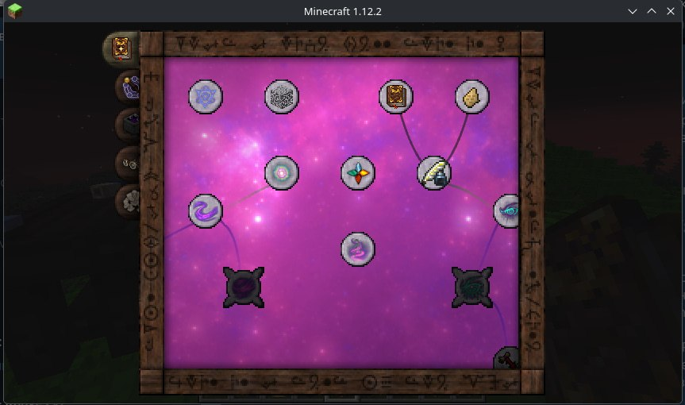
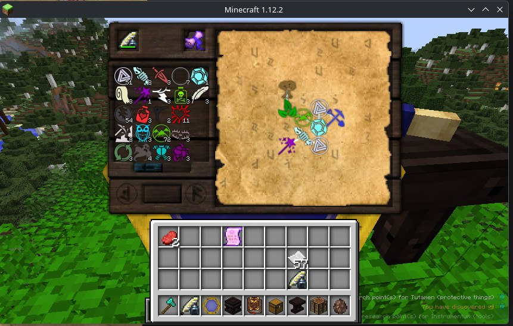
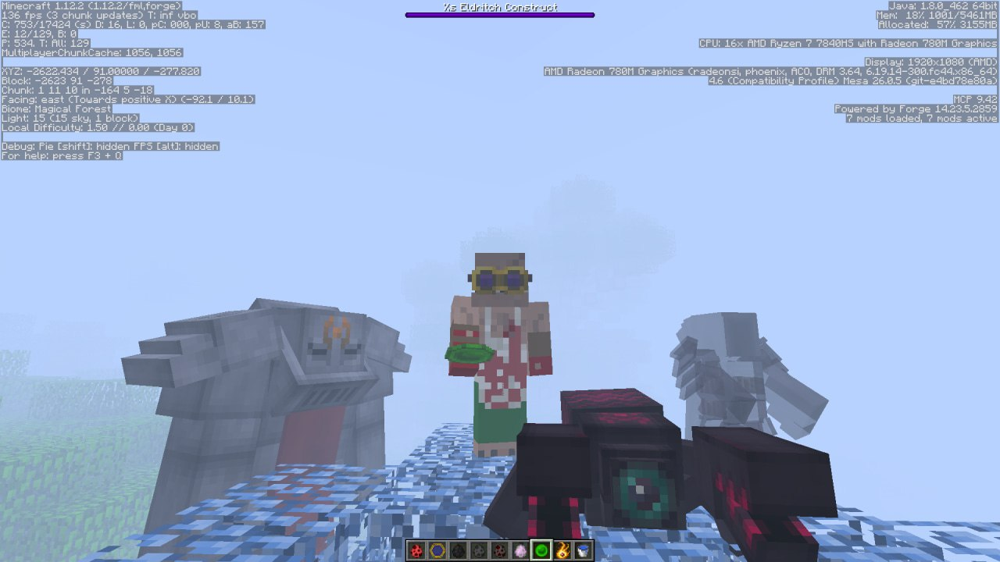

# Thaumcraft 4.2.3.5 — Forge 1.12.2 Port

Port of Thaumcraft 4.2.3.5 from Minecraft 1.7.10 to 1.12.2.

Original mod by Azanor (2013-2015). This is an unofficial community port.

## Showcase

  
  

  

## Status

Active work-in-progress port. Core systems are wired, and a large July 2026 cleanup restored many visible TC4 parity issues: Thaumonomicon recipe pages, focus visuals, TC particle rendering, jars, essentia phials, Brain in a Jar behavior, and Travel/Warding paving stone parity.

Remaining work is mostly item-specific logic, runtime parity testing, and final visual/rendering polish.

## Project stack

- **Language:** Java 8
- **Runtime:** Minecraft Forge 1.12.2 (14.23.5.2847)
- **Mappings:** stable_39
- **Build:** Gradle (ForgeGradle 2.3)
- **Dependency:** Baubles (CurseMaven)
- **Optional integration:** JEI 4.16.1.1012
- **Bundled:** CodeChicken Lib (thaumcraft.codechicken.*)

Install JEI without Thaumic JEI to browse Thaumcraft's Arcane Workbench, Crucible, and Infusion recipes. Thaumic JEI targets Thaumcraft 6 and is not compatible with this TC4 port.

## What works

- Core alchemy and crafting systems
- Infusion
- Golems
- Research system
- Thaumonomicon research tree, text/images, and recipe pages
- Arcane/crucible/infusion recipe page rendering in the Thaumonomicon
- World generation / Aura
- Mob spawning, AI, and textures
- Outer Lands dimension
- TC4-style particle routes for many client effects
- Jar rendering, essentia liquid display, labels, and Brain in a Jar visuals
- Wand focus visuals for restored foci such as Pech and Hellbat
- Paving Stone of Travel and Paving Stone of Warding behavior, including redstone state parity, invisible warding aura collision, and TC4 rune particle visuals

## Known limitations

- Some item-specific logic is still incomplete or needs parity review for remaining edge-case items
- Infusion crafting gameplay still needs full runtime verification; the matrix renderer itself has been hardened
- Visual parity is much better after the July cleanup, but remaining models/renderers/textures still need comparison against TC4
- Untested systems may still have defects

## Development

Solo project. Development assisted by LLM agents using various models (GPT 5.5, GLM 5.2, Deepseek V4, MiMo V2.5, etc.).

### Major known issue

Rendering/model parity remains the largest ongoing work area. Many high-visibility TC4 visuals have already been restored, but the original 1.7.10 rendering pipeline still does not map cleanly to Forge 1.12.2 baked models. Remaining work includes UV cleanup, JSON model conversion, display transforms, and per-item model routing.

## Downloads

Pre-built binaries are available in [Releases](https://github.com/0FL01/Thaumcraft-4.2-FOREVA/releases). Download `Thaumcraft-1.0.0-universal.jar` from the latest release — builds are published automatically on every push.

## License

MIT License. See `LICENSE` for details.

Original Thaumcraft 4.2.3.5 (c) 2013-2015 Azanor.
